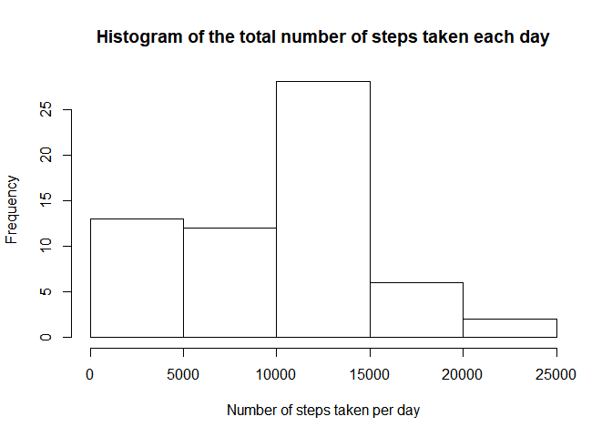
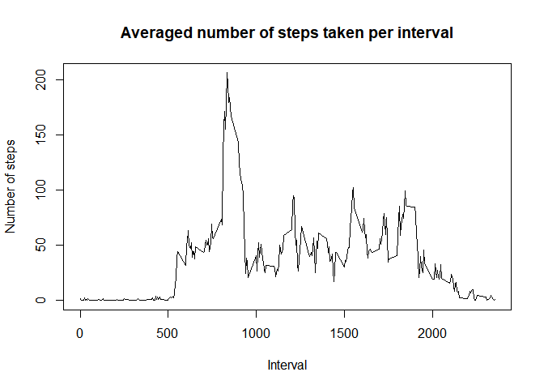
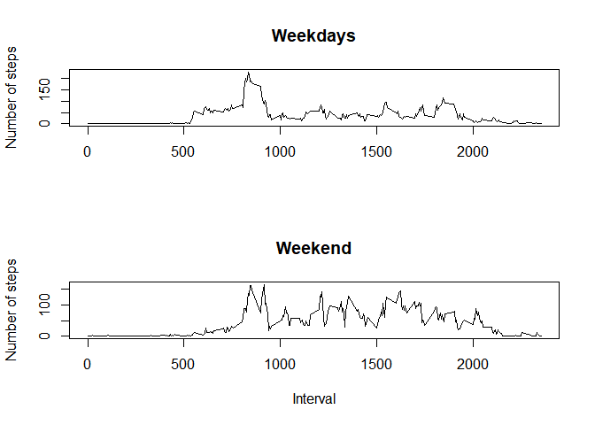

1. Data loading
---------------

Load the data usinf read.csv()

    activity <- read.csv("activity.csv")

2. Preprocess data
------------------

First prepare dates value to be real date format (makes plotting easier)

    activity$date <- as.Date(as.character(activity$date), "%Y-%m-%d")

3. Ignore missing data
----------------------

### 3.1 Calculate steps taken each day

    sum_steps <- function(x){sum(x$steps, na.rm=TRUE)}
    steps_each_day <- sapply(split(activity, activity$date),sum_steps)
    steps_each_day

    ## 2012-10-01 2012-10-02 2012-10-03 2012-10-04 2012-10-05 2012-10-06 
    ##          0        126      11352      12116      13294      15420 
    ## 2012-10-07 2012-10-08 2012-10-09 2012-10-10 2012-10-11 2012-10-12 
    ##      11015          0      12811       9900      10304      17382 
    ## 2012-10-13 2012-10-14 2012-10-15 2012-10-16 2012-10-17 2012-10-18 
    ##      12426      15098      10139      15084      13452      10056 
    ## 2012-10-19 2012-10-20 2012-10-21 2012-10-22 2012-10-23 2012-10-24 
    ##      11829      10395       8821      13460       8918       8355 
    ## 2012-10-25 2012-10-26 2012-10-27 2012-10-28 2012-10-29 2012-10-30 
    ##       2492       6778      10119      11458       5018       9819 
    ## 2012-10-31 2012-11-01 2012-11-02 2012-11-03 2012-11-04 2012-11-05 
    ##      15414          0      10600      10571          0      10439 
    ## 2012-11-06 2012-11-07 2012-11-08 2012-11-09 2012-11-10 2012-11-11 
    ##       8334      12883       3219          0          0      12608 
    ## 2012-11-12 2012-11-13 2012-11-14 2012-11-15 2012-11-16 2012-11-17 
    ##      10765       7336          0         41       5441      14339 
    ## 2012-11-18 2012-11-19 2012-11-20 2012-11-21 2012-11-22 2012-11-23 
    ##      15110       8841       4472      12787      20427      21194 
    ## 2012-11-24 2012-11-25 2012-11-26 2012-11-27 2012-11-28 2012-11-29 
    ##      14478      11834      11162      13646      10183       7047 
    ## 2012-11-30 
    ##          0

### 3.2 Plot histogram of of steps taken each day

    hist(steps_each_day,main="Histogram of the total number of steps taken each day", xlab = "Number of steps taken per day")

### 3.3 Calculate mean of total steps taken per day

    mean(steps_each_day)

    ## [1] 9354.23

### 3.4 Calculate median of total steps taken per day

    median(steps_each_day)

    ## [1] 10395

### 3.5 Average daily activity pattern - time series plot

    my_activity <- split(activity, activity$interval)
    my_means <- matrix(nrow=length(my_activity),ncol=2)
    for (i in 1:length(my_activity)){my_means[i,2]<-mean(my_activity[[i]]$steps, na.rm=TRUE)
    my_means[i,1]<-unique(my_activity[[i]]$interval)}
    plot(my_means, type="l", main="Averaged number of steps taken per interval", xlab="Interval", ylab="Number of steps")

### 3.6 Average daily activity pattern - interval with max number of steps

    my_means[which.max(my_means[,2]),1]

    ## [1] 835

4. Impute missing data
----------------------

### 4.1 Calculate total number of NAs in steps column

    sum(is.na(activity$steps))

    ## [1] 2304

### 4.2 Get rid of NAs in steps variable by switching it with mean of all the available values for this specific interval:

    activity_fixed=activity
    for (j in 1:length(activity_fixed$steps)){if(is.na(activity_fixed$steps[j])) activity_fixed$steps[j]=my_means[which(my_means[,1]==activity_fixed$interval[j]),2]}
    head(activity_fixed)

    ##       steps       date interval
    ## 1 1.7169811 2012-10-01        0
    ## 2 0.3396226 2012-10-01        5
    ## 3 0.1320755 2012-10-01       10
    ## 4 0.1509434 2012-10-01       15
    ## 5 0.0754717 2012-10-01       20
    ## 6 2.0943396 2012-10-01       25

    head(activity)

    ##   steps       date interval
    ## 1    NA 2012-10-01        0
    ## 2    NA 2012-10-01        5
    ## 3    NA 2012-10-01       10
    ## 4    NA 2012-10-01       15
    ## 5    NA 2012-10-01       20
    ## 6    NA 2012-10-01       25

### 4.3 Plot histogram of steps taken each day

    steps_each_day_fixed <- sapply(split(activity_fixed, activity_fixed$date),sum_steps)
    hist(steps_each_day_fixed,main="Histogram of the total number of steps taken each day \n for data with NA imputed", xlab = "Number of steps taken per day")

### 4.4 Mean and median number of steps taken each day

    mean(steps_each_day_fixed)

    ## [1] 10766.19

    median(steps_each_day_fixed)

    ## [1] 10766.19

### 4.5 Differences in activity patterns between weekdays and weekends

Check whether day is a weekday or weekend (for Polish week day names)

    weekday_or_weekend <- function(x){if((weekdays(x)=="sobota") | (weekdays(x)=="niedziela")) "weekend" else "weekday"}
    activity_fixed$day_type <- factor(sapply(activity_fixed$date, weekday_or_weekend))
    activity_dayType <- split(activity_fixed, activity_fixed$day_type)
    my_activity_weekday <- split(activity_dayType[["weekday"]], activity_dayType[["weekday"]]$interval)
    my_activity_weekend <- split(activity_dayType[["weekend"]], activity_dayType[["weekend"]]$interval)
    my_means_weekday <- matrix(nrow=length(my_activity_weekday),ncol=2)
    for (i in 1:length(my_activity_weekday)){my_means_weekday[i,2]<-mean(my_activity_weekday[[i]]$steps, na.rm=TRUE)
    my_means_weekday[i,1]<-unique(my_activity_weekday[[i]]$interval)}
    my_means_weekend <- matrix(nrow=length(my_activity_weekend),ncol=2)
    for (i in 1:length(my_activity_weekend)){my_means_weekend[i,2]<-mean(my_activity_weekend[[i]]$steps, na.rm=TRUE)
    my_means_weekend[i,1]<-unique(my_activity_weekend[[i]]$interval)}
     split.screen(c(2, 1))

    ## [1] 1 2

     screen(1)
    plot(my_means_weekday, type="l", main="Weekdays", xlab="",ylab="Number of steps")
    screen(2)
    plot(my_means_weekend, type="l", main="Weekend", xlab="Interval", ylab="Number of steps")

    close.screen(all = TRUE)
